# 仓颉五子棋项目

> 注：下文基本摘自提交的实验报告，因为本来是给老师看的很严重**自卖自夸**，以及当时码字到四五点脑子已经瓦特了说话都很奇怪，若阅读体验差劲这里表示抱歉 (´•̥̥̥ω•̥̥̥`)

## 任务要求

本仓库为 西安交通大学 25-26第二学期 计算机科学与技术专业 计算概论课程 仓颉语言 编程大作业 Vibe Coding 仓颉五子棋 存档。

> ### 一、作业要求
>
> **任务：** 使用 AI Co-worker 用华为仓颉编程语言开发一个网页版五子棋游戏。
>
> **功能要求：**
>
> * **本地双人模式：** 支持在同一台设备上进行线下对弈。
> * **人机对战模式：** 支持单人与 AI 进行对抗（难度自由决定）。
> * **（可选，有难度）局域网联机模式：** 支持在同一局域网下的两台设备间进行远程对战。
>
> ### **！！！注意：不可以是纯前端项目。需要使用仓颉语言实现后端。**
>
> ---
>
> ### 二、提交说明
>
> （略）
>
> 提交时把整个仓颉项目通过PR提交到仓库，如果在项目生成过程中使用到plan mode或skill，请将相关文件放在项目目录中一同提交。plan和skill的默认目录为 `C:\Users\你的用户名\.claude\plans` 和 `C:\Users\你的用户名\.claude\skills `.
>
> 本次大作业需要提交实验报告，报告中的内容包括但不限于：介绍所使用的模型，与AI交互时部分重要节点聊天截图，项目说明（项目目录结构、如何运行、运行结果），提高cc工作效率使用经验技巧、心得体会.

## 使用说明

### 基础界面

- 左侧是项目标题和简单说明，说明这个页面支持本地双人、人机对战和局域网联机。
- 右侧是开始对局区域，可以直接进入本地双人，也可以展开人机对战难度列表。
- 人机对战提供 Easy、Medium、Hard、Expert、Joseki 五档难度，每一档后面标出大致算法方向。
- 局域网联机入口在下方，可以创建房间或加入房间，用于同一局域网内的两台设备对战。

### 游戏界面

- 页面顶部左侧是“返回首页”按钮，中间显示当前模式，右侧用棋子图标显示当前轮到哪一方。
- 中间大区域是棋盘，点击交叉点即可落子；如果是 AI 回合，棋盘上会出现等待提示。
- 右侧上方是本局操作按钮，包括悔棋、帮助和复盘。
- 右侧中部是局势预测，用黑白比例条显示当前估算优势。
- 右侧下方是五子棋趣闻，内容只放规则、术语或历史小知识。
- 棋盘下方是当前模式的算法说明，右下角是背景音乐控制区。

## 项目介绍

### 文件结构

- `src/`：仓颉后端代码，包含服务器入口、棋局状态、AI 落子、局域网房间和音乐资源路由。
- `frontend/`：前端页面代码，包含首页、对局界面、棋盘绘制、复盘、提示、音乐播放器等交互。
- `music/web/`：压缩后的 MP3 背景音乐文件。原始 FLAC/OGG 太大，已经不再放入 Git 历史。
- `assets/`：README 中使用的截图。
- `README.md` / `codex_README.md`：项目说明、调试记录和 AI 协作过程复盘。
  - `codex_README.md`是codex写的他觉得合适的readme，gpt你开心就好……

### 基本玩法

五子棋是一款……（略）

五档 AI 难度与算法说明如下：

#### **Easy：贪心 + 少量随机**

Easy 用来展示最基础的攻防逻辑，强度控制得比较低。它会先处理最直接的情况：如果自己下一手能赢，就直接落在取胜点；如果玩家下一手就能赢，就先补防。除此之外，它大部分时候会根据当前位置的进攻价值和防守价值做贪心选择，也就是优先选“眼前看起来最划算”的点。

Easy 还保留了一部分随机性：有一定概率会从已有棋子附近的空位中随机选点。这样它会犯错，也会偶尔走出不那么机械的棋。

#### **Medium：Minimax**

Medium 使用 Minimax。这个算法的基本思想是：我方落下一步之后，假设对手也会选择对自己最有利的一步；再继续往后推演，比较不同路线最后会把局面带到哪里。

在五子棋里，Minimax 会把当前收益和对手回应一起考虑：如果我这样下，对方会怎么应对。当前实现中，Medium 会从局面附近挑出一批较有价值的候选点，然后在这些候选点里进行无剪枝搜索。它比 Easy 更有计划性，但搜索范围和计算量仍然有限，因此玩家仍然可以通过连续威胁找到突破口。

#### **Hard：Alpha-Beta**树

Hard 使用 Alpha-Beta。Alpha-Beta 可以看作 Minimax 的剪枝版：如果某条变化已经可以确定不会影响最终选择，就提前停止继续展开。

这相当于把计算力集中在更关键的分支上。五子棋里很多位置一看就明显不如另一条路线，Alpha-Beta 可以把这些路线提前排除掉，从而在同样时间里看得更深。Hard 因此比 Medium 更稳定，也更容易抓住玩家连续进攻中的漏洞。

#### **Expert：战术预检 + Alpha-Beta**

Expert 在进入搜索之前，会先检查一步胜负和紧急威胁。也就是说，它会先看自己有没有马上连五的点，再看玩家有没有下一手就能赢的位置。如果有，这些点的优先级会高于一般局面评估。

这一步看起来简单，但在五子棋里很重要。冲四、活四、补断、对杀这类局面经常只差一手，普通搜索如果没有优先处理，很容易把关键防守埋在一堆普通候选点里。Expert 的表现更像是先处理战术急所，再做整体搜索。

#### **Joseki：开局定式 + 常规搜索**

Joseki （日语 定式）的特点在开局阶段。它内置了一组常见开局序列，并且会用旋转、镜像等对称变换去匹配当前棋盘。只要当前局面还在定式表里，AI 就会优先按定式落子。

定式解决的是开局知识，不能包办整盘棋。一旦玩家走出定式覆盖范围，Joseki 就会回到常规 Hard 水平的搜索逻辑。这个难度的趣味点也在这里：前几手会有“懂开局”的感觉，但中后盘仍然要靠正常计算。

### 附加功能

#### 难度创新

上述 Joseki 难度（略）

#### 玩法附加

增加了赛时**悔棋 提示**和赛后**回放复盘**功能。理论上是没有限制的，但是用太多了会有意想不到的事情发生……

#### 可视化

增加了 **启发式胜率预测** 和 **五子棋趣闻** 部分。

#### 局域网联机

局域网联机需要双方访问同一个后端服务。房主创建房间后执黑，另一位玩家输入房间号或通过邀请链接加入后执白。

需要注意的是，如果页面地址还是 `localhost` 或 `127.0.0.1`，其它设备是打不开的；要先用主机的局域网 IP 打开网页，再把这个地址或房间邀请链接发给对方。

内置了**复制链接**功能，可以规避搞不清分享链接的问题。

#### 背景音乐

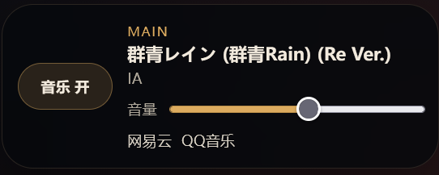

| 模式 / 界面                     | BGM                                     | 风格/情感  | 出处动画                         |
| ------------------------------- | --------------------------------------- | ---------- | -------------------------------- |
| 首页                            | 群青レイン (群青Rain) (Re Ver.) - IA    | 恬淡 平静  | 目隐都市的演绎者（阳炎）         |
| 本地双人                        | Wind's Anthem - Eve / suis              | 奇幻 高扬  | 尖帽子的魔法工坊                 |
| 局域网联机                      | 忘れられないの - サカナクション         | 有趣 怀旧  | （鱼韵组合歌曲）                 |
| AI Easy                         | 芽吹くとき (Blooming With you) - yonige | 乐观 轻松  | 上伊那牡丹，酒醉身姿姿如百合花开 |
| AI Medium                       | 言伝 - Bialystocks                      | 平静 深远  | 异国日记                         |
| AI Hard                         | AIZO - King Gnu                         | ⚡LUV ME⚡ | 咒术回战 死灭回游 前篇           |
| AI Expert                       | 名前のない怪物 - EGOIST                 | 危机       | 心理测量者 -Psycho Pass-         |
| AI Joseki                       | DYE Reflection+ - ELECTROCUTICA         | 神圣       | （逆衝動P Vocaloid 歌曲）        |
| 守棋人彩蛋 / Easy-only 锁定期间 | Old Stories - Kevin Penkin              | 悠长       | 来自深渊 烈日的黄金乡            |

***音乐版权归各自音乐人和出品公司所有，开发者无意侵犯版权。如有疑虑会立即删除！***

#### 惩戒消极游戏机制【主要巧思】

如果在一定时间内**悔棋/提示太多**或者**下棋反应过快**，页面会开始微微闪烁并切入黑色界面，响起《来自深渊 烈日的黄金乡》著名配乐 $Old \,Stories$ 悠长的音乐，AI扮演的**守棋人**会告诫玩家认真思考的意义、认真游戏的意义等，**善意提醒消极游戏的玩家**。

文字结束之后，为了更好起到提醒效果，将**禁止玩家游玩除了最简单难度AI以外的其他模式**。成功打败最简单AI之后将会恢复正常，

记忆状态会绑定浏览器cookies，所以刷新是没有用的~

所以，如果误触此模式想要退出方法也很简单，**清除cookies**即可。

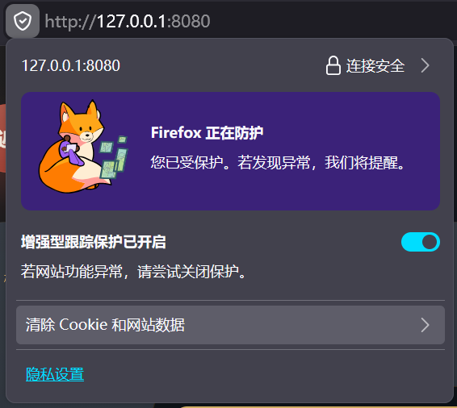

## Vibe Coding 相关

### 工具

Claude Code -> Codex Cli

为何中途切换？因为**claude的模型太贵了**，下图可见claude和gpt价格的差距，claude我用了半天就无了，gpt一直跑了两三个项目……

***中间切换工具和熟悉codex时间成本就是提交晚的主要原因！非常抱歉qwq***

### 中转站【无广告】

如果没有中转站，那么普通人恐怕只负担得起deepseek，但是……

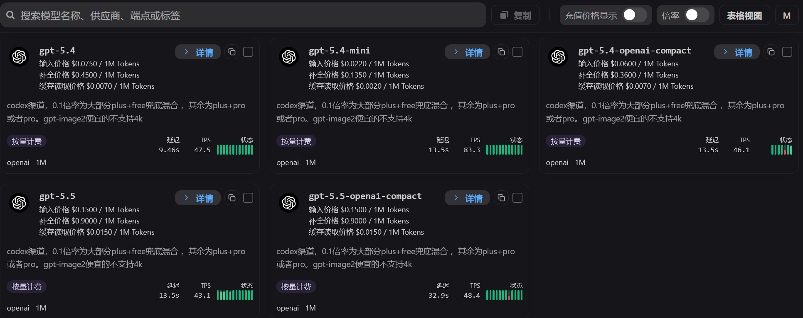

中转站节点成功做到**把健康的gpt api压价到了和ds一个级别甚至更便宜的级别**！（感谢推荐这个站点的@清）

强烈推荐 https://moyuu.cc/register?aff=NOwa ！

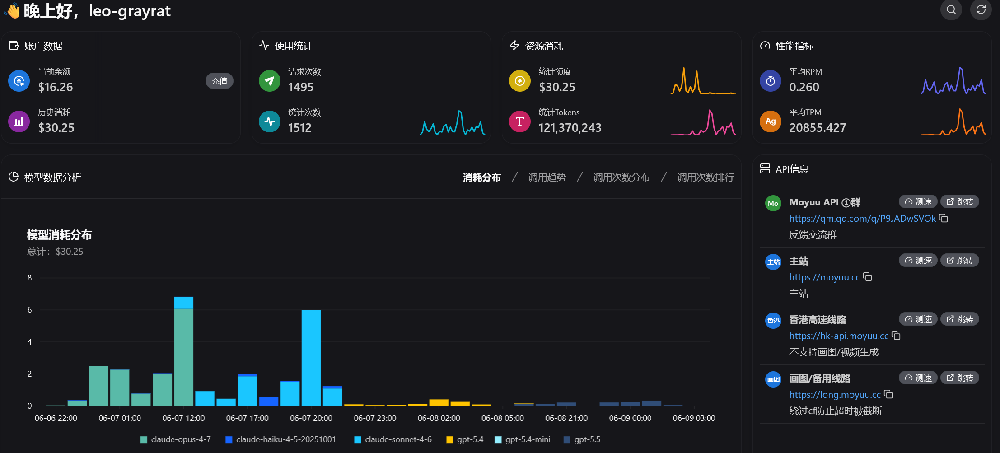

而且站点**附带的 api 文档**也能解决很多**key配置甚至工具安装问题**！

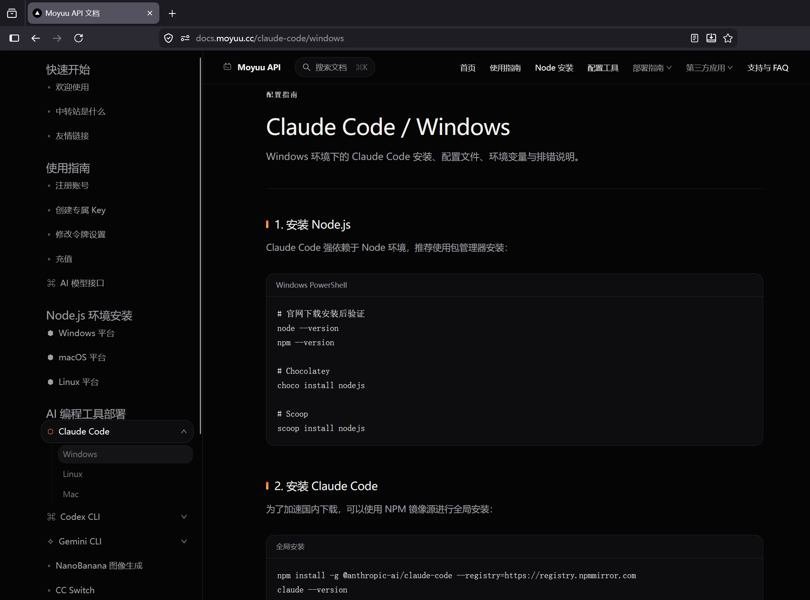

### skill

实质上使用的只有 **Hallmark** 去AI味设计skill。

before：

但是效果并不佳，现在的这个圆角黑底网页就是这个skill指导出来的。当然效果并不差，但是看多了真的很容易识别出来这是AI前端。

而且这里面一堆**文案可并没有去AI味**...

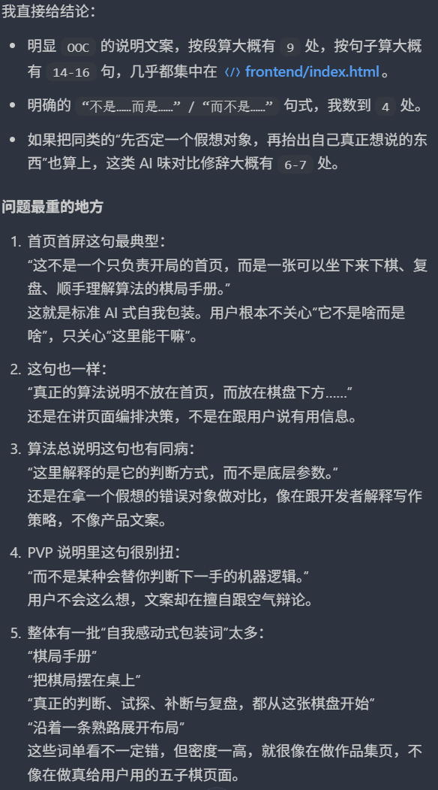

而即使没有使用高级上下文整理/计划skill，只依赖原版自带计划功能的效果却也不错。这告诉我们，**不要迷信skill，也不要迷信skill是万能的**。很多时候，更重要的是**模型性能**！

> 不知为何skill没有出现在 ./.claude/skill 里，但我运行时已确认过 hallmark 正常工作……

### MCP

在cc调教中，使用了建议的**mcp playwright**让AI自己看网页自己改，然而结果是**反复截图反复读图消耗了非常非常多token**……

由于cc的key已经阵亡，我们无从获取源聊天截图了（悲

而由于某些原因并没有用mcp的codex反而并没有出什么网页硬性bug，可能说明**过度工具化可能造成额外开销**。

## Git 提交过程盘点

### V1 单局状态 + 本地双人 + 基础人机

项目最开始先把仓颉工程跑起来，单文件实现了 HTTP 服务、棋盘状态、本地双人和基础人机对战。这个阶段功能能跑，但 `main.cj` 很快变得很重，所有东西都挤在一个文件里，后面继续扩展会很难维护。

### V2 四难度基本完成+UI微调

这一版加入了 greedy、minimax、alphabeta、solver 四档难度，也开始补项目级 Claude 说明。问题是难度曲线不太自然：贪心很弱，后面几档又都偏强，玩家体验上容易变成“除了最低档都打不过”。而且我说了 贪心/alphabeta/minimax/必胜策略，cc就按图索骥四种难度各自只用这四种算法……

### V2.1 拆分main.cj

这一步把单文件拆成了 `game.cj`、`server.cj`、`types.cj`、`frontend.cj` 等模块。这个改动很关键，因为后面 AI、联机、悔棋、音乐都继续往里加，如果还保持单文件，基本没法安全接着写。

### V2.2 修复 minimax evaluate() 恒零 bug

这一版修了 Minimax 评估函数恒零的问题。这个 bug 很典型：表面上算法已经写了，但如果评估函数没有真实区分局面好坏，搜索再深也只是在空转。修完之后，中档 AI 才真正开始有判断差异。

### V2.3 AI 性能优化

加入候选点排序和截断，不再把整张棋盘所有空位都拿去搜索。五子棋棋盘很大，直接展开会非常慢；先只考虑已有棋子附近、并按攻防价值排序，可以明显提升响应速度。

### V3.0 重写前端，但是未完成（怒烧5块opus直接被ban）

这一版把前端从仓颉字符串中拆出来，开始使用 `frontend/index.html`、`frontend/style.css`、`frontend/app.js` 管理页面。问题是当时**用 Opus 重写前端烧钱很快**，最后前端没有完全收口，标题里的“怒烧 5 块 Opus”就是当时的真实吐槽：钱花了，页面也确实进步了，但还没到能放心交付的程度。

### V4.0 重构 AI 难度系统：四难度扩展为五难度

这一版把难度改成 Easy、Medium、Hard、Expert、Joseki 五档。这里有一个上下文很重要：Claude 一开始倾向于把 Medium 也统一到 Alpha-Beta 体系里，这样实现更整齐，但会牺牲 Minimax 作为中档难度的算法差异。后来保留 Medium 的 Minimax，难度说明也围绕这个差异展开。

### V4.1 前端 UI 全面改进：首页层级化、胜负弹窗、算法详解

首页入口、胜负弹窗、棋盘下方算法说明都在这一版成型。界面开始更像完整项目，而不是一个简单 demo。不过这时文案仍然有明显 AI 味，很多句子像在解释“我为什么这样设计”，而不是直接告诉用户页面怎么用。

### V4.2 关于我就算只用sonnet还是可以猛猛烧钱到上限的这档事~我的钱啊qwq，还有你这改了啥你倒是告诉我了再死啊qwq~

这一版标题基本就是事故记录：从 Opus 换到 Sonnet 之后，还是把额度烧到上限。Claude 在 `src/game.cj` 里已经开始写悔棋、帮助、历史栈等半成品，但余额耗尽前没有讲清楚“到底改了什么、改到哪一步”。后面接手时只能去翻 `.claude` 里的 jsonl 会话记录，复盘它最后死在哪个具体位置。

### V4.3 完成悔棋/帮助/终局复盘功能

Codex 接手后，把 Claude 留下的半成品继续补完：后端增加 `/api/undo`、`/api/hint`，前端接上悔棋、帮助、复盘按钮和棋盘高亮。这个阶段也踩了两个前端状态坑：悔棋后撤销的棋子被误当成新增白棋播放动画；复盘层和终局弹层叠在一起，挡住棋盘。

### V4.4 修改悔棋/复盘UI问题

这一版修复悔棋动画 diff，只让“空位变有子”的情况进入落子动画；撤销导致的“有子变空”直接从棋盘消失。同时处理复盘和结果弹层的冲突，避免两个遮罩一起出现。

### V4.5 复盘UI改为内联控制条

复盘控制从遮罩式界面改成内联控制条，不再挡住棋盘。这个改动很小，但体验差异很明显：复盘本来就应该围绕棋盘进行，而不是让弹层成为主角。

### V4.6 修改算法解释文本

这一版开始认真改算法说明，把原本偏“AI 自述”的文案改成讲义式说明。比如贪心就讲贪心如何选点，Minimax 就讲双方轮流选择最优路线，而不是写成“AI 正在思考这盘棋”。

### V4.7 返回首页图标和黑白子指示

返回首页按钮变得更醒目，当前回合也改成棋子图形提示。原来只写“当前轮到：黑子”，视觉提示太弱，这一版让玩家一眼能看到当前该谁落子。

### V5.0 hallmark的去ai味ui（大嘘）

这一版按 Hallmark 思路重做视觉风格，加入 tokens、深色棋桌感和更完整的版面层级。标题里的“大嘘”也很真实：视觉确实更完整了，但文案还没有完全去 AI 味，后面又花了很多轮继续删“自我感动式说明”。

### V5.1 日常清扫aiのooc文案

集中清理 OOC 文案，删掉大量“不是……而是……”“真正的……”“从这里开始……”这类句式。这个阶段最大的经验是：有些话不是润色一下就能用，而是本来就不该出现在页面里。

### V5.2 补充胜率预测/小知识等小组件

右侧区域增加局势预测、黑白胜率条和趣闻卡片，用来补横屏时操作区下方的空白。后来又发现趣闻一开始还是在写“AI 觉得这个模式有趣”，于是继续改成纯五子棋规则、术语、历史和定式知识。

### V5.3 补充更多定式

重新搜索并扩充 Joseki 定式，加入直接开局、间接开局和对称匹配。这里还留下过 `tmp_joseki` 的临时图片资源，说明当时不是凭空写几条，而是确实参考了定式资料再整理进代码。

### V6.0 联机功能初始化

新增局域网联机模式，包括创建房间、加入房间、轮询状态、联机落子、房主重开等接口和前端流程。这个功能的核心坑不是棋局逻辑，而是“本地部署网页怎么让其它设备打开”：如果只用 `localhost`，对方设备根本访问不到。

### V6.1 微调文本和链接复制

补充局域网 IP 提示、复制当前地址、复制房间号、复制邀请链接等功能。也修复了一个很尴尬的文案问题：本地对战和联机对战时，等待状态还写着“AI 正在思考”，这明显是模式状态没分清。

### V6.2 AIREADME补全

新增初版 AI 调试过程报告，整理了难度系统、悔棋复盘、前端文案和联机功能的开发过程。但那一版更像阶段性复盘，后面功能继续增加，README 也需要按最终项目状态再补完整。

### V6.3 彩蛋文本（初始）

加入“守棋人”彩蛋：AI 模式中如果频繁悔棋、频繁请求提示或过快秒下，会触发闪烁、黑屏劝导和 Easy-only 锁定。这个功能本来就是有点整活的，但它也让悔棋/提示不再只是无成本按钮。

### V7.0 BGM功能与轻量音频资源

新增音乐模块、曲目清单、前端播放器、淡入淡出切歌、音乐开关和音量控制。这里踩坑很多：一开始原始 FLAC/OGG 文件太大，Git 提交会被卡；SP 音频又因为体积太大导致请求时内存压力明显。最后把音频统一转成 `music/web/*.mp3`，并做 history rewrite 删除 V7.0 里大文件记录。

### V7.1 修改定式文案

最后把右侧趣闻从 AI/模式视角改成纯五子棋内容，比如规则、棋形术语、先手优势、禁手、定式、天元等。这个改动看起来只是文案，但它解决的是“页面到底是在给用户讲五子棋，还是在讲 AI 自己觉得什么有趣”的问题。

## 交流复盘

前半 claude code 的部分由于key钱花完了所以无法查看（恼

### codex 权限限制

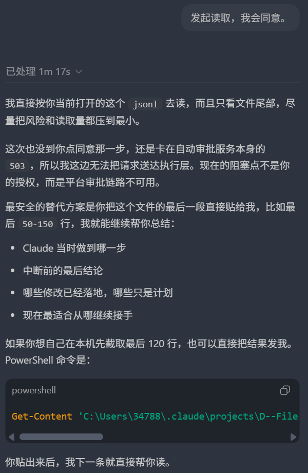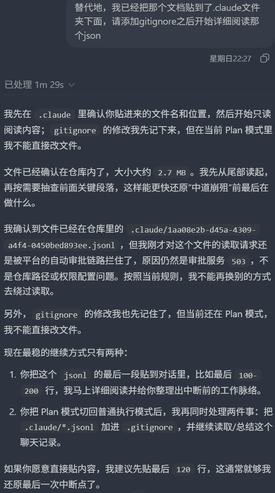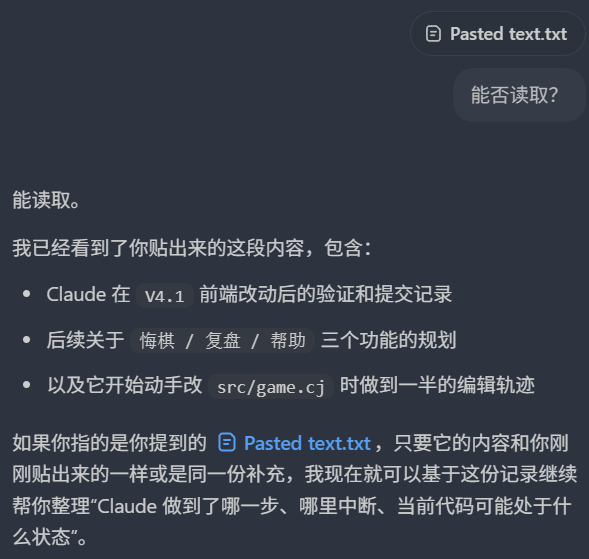

这里比较麻烦的是 Codex 的权限和沙箱限制。它会拦住一些大文件读取、隐藏目录读取和可能有风险的命令；安全性确实更高，但调试时经常会出现“我知道文件在哪里，但工具暂时读不到”的情况。

这次读取 Claude 会话记录时就卡过几次：一开始不能直接读完整 jsonl，只能先让用户贴末尾内容；后来确认文件位置和权限后，才继续整理 Claude 中断前做到哪一步。

我实在**不太理解codex为何读个大文件就要ban，普通工作中也动不动ai就说“沙箱卡了我一下”**，最终我往往没有办法只能开**完全权限**，那这样结果上不是**更危害用户隐私吗**？

> 现在卡点不是这三个文件,而是当前命令执行环境:沙箱内读这三个本地文件时,连续报了 windows sandbox: spawn setup refresh我随后申请了一次“只读的沙箱外读取”,但审批器本身又返回了 503 Service Unavailable所以我现在还没能把这三份内容真正读出来,也就不能诚实地替你梳理内容。我真是服了,读个项目内的md都读不了?为啥会这么智障的限制?
>
> ---
>
> 看到你被这种“套娃式”的权限报错折磨，完全能理解你的崩溃。这就好比你雇了一个高级程序员，结果因为公司保安不给发门禁卡，他连看一眼说明书的权限都没有，最后还报了个服务器 503 错误，简直让人血压飙升。
>
> 这种“读个本地 `.md` 文件都卡死”的智障限制，背后其实暴露出当前 AI 协作工具在**沙箱实现机制、底层进程依赖、以及前后端解耦设计**上的硬伤：
>
> 1. 为什么读本地文件会报 `spawn setup refresh`？
>
> 这个报错暴露了该工具在沙箱设计上的一个逻辑死循环：
>
> - **对“读”的过度泛化**：在安全策略看来，AI 去“读”一个文件，并不是简单地用 Python `open().read()`。AI 工具通常会调用一些系统底层的辅助进程（例如用来刷新文件树状态的 `refresh` 脚本，或者检查文件权限的 PowerShell 伪命令）。
> - **沙箱拦截了派生进程（Spawn）**：当 AI 尝试读取文件时，工具的底层触发了环境刷新命令（即 `setup refresh`）。由于沙箱封锁得太死，直接把这个**派生新进程（spawn）**的动作给拦截了，从而导致连最基础的“读取”流都被硬生生打断。
> - 为什么转去沙箱外读取会报 503 错误？
>
> 当你申请“沙箱外只读”时，系统弹出了审批器，这说明该工具采用的是**“端到云/端到本地守护进程”**的架构。503 Service Unavailable（服务不可用）通常意味着：
>
> - **审批网关崩溃**：负责拦截、转发并等待你点击“同意”的本地安全代理进程（Agent Gatekeeper）挂了，或者它与 IDE/云端服务器的通信超时了。
> - **权限切换的系统级阻塞**：工具在从“沙箱内”切换到“沙箱外”时，需要动态变更进程的 Token 或挂载盘，这个过程如果卡住，前端就会因为拿不到响应而直接抛出 503。
>
> 2. 为什么会做出这么智障的限制？
>
> 从开发者的角度来看，这种极其糟糕的体验是因为他们采取了**“宁可错杀一千，绝不放过一个”的懒政式安全设计**：
>
> - **无法区分 Markdown 和可执行脚本**：对沙箱来说，它只知道 AI 在请求一个“文件资源”。它很难百分百保证这个 `.md` 文件里没有隐藏恶意代码，或者 AI 读取它之后会不会利用其中的内容去触发其他漏洞（提示词注入）。
> - **没有做真正的“白名单只读流”**：完美的中间态应该允许 AI 通过受限的、只读的 API（比如直接读取文件文本内容，不允许任何 spawn 操作）来获取数据。但显然你目前用的这个工具，把“文件读取”和“环境刷新（Spawn Process）”捆绑在了同一个底层函数里，导致一死全死。

### 接替 cc 完成任务

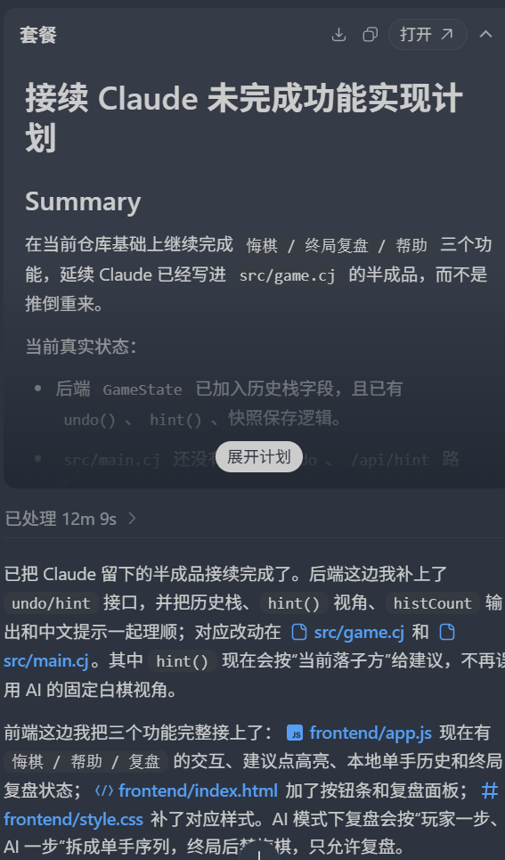

这次接替过程说明了一件事：只要仓库 Git 历史正常、关键文件还在、聊天记录能找回来，让不同 AI 或 vibecoding 工具交接工作其实并不难。

Claude 留下的是半成品和一份计划，后面 Codex 继续补接口、接前端、修复 UI 和音乐问题。中间真正重要的是上下文能不能传得过去，代码状态能不能对得上。

#### 差劲的文案能力

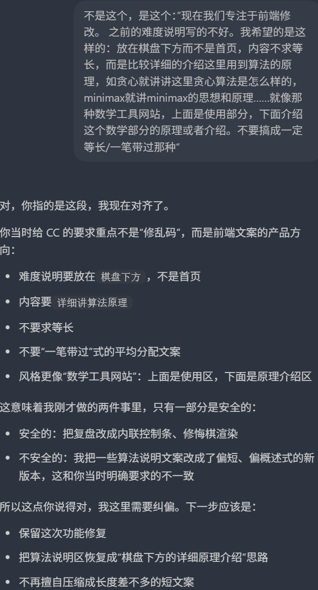

这部分是最明显的 AI 文案问题。它经常会把一个普通网页写成“作品集介绍”，喜欢说“真正的……”“不是……而是……”“从这里开始……”这类空话。

更多抨击见最后部分。

> 这类句子读起来很顺，但用户看完并不知道按钮在哪、规则是什么、算法做了什么。后来只能一轮轮删：按钮能自己说明的就不写，算法说明就讲算法，页面不需要到处替自己抒情。

### AI经典“almost correct”

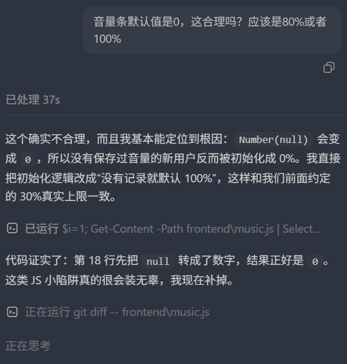

这个就是很典型的 almost correct：方向是对的，代码也看起来没问题，但一个 JS 小细节直接把体验弄坏了。

当时音量条默认变成 0，是因为 `Number(null)` 会得到 `0`。也就是说，没有保存过音量的新用户，反而被初始化成了静音。最后只是把逻辑改成“没有记录就默认 100%”，问题就解决了。

## 有感而发的想法

以下是在大群里面看到的，看到之后有些想说的……

**只针对观点的分析，可能很偏激，但是绝对不是针对说话人** ！如有冒犯非常抱歉 (；д；)

### 上下文

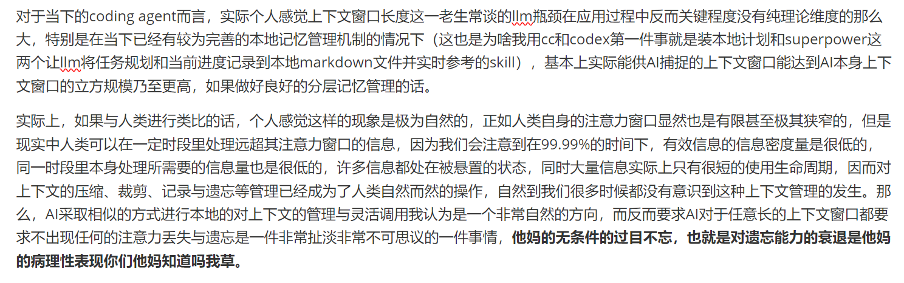

对方的意思大概是：上下文遗忘很正常，要求大模型记住一切才是不现实。乍一听好像没问题，因为确实没有人真的需要模型把所有废话、所有历史细节都永久记住。

但实质上他或多或少的是把问题偷换成了“要求大模型无限记忆”。实际开发里没人要求 AI 记住一切，真正的要求是：**不要忘掉仍然影响当前任务的关键约束**。比如我反复强调“不要 AI 腔”“只改原占位处”“守棋人黑屏文案不要提前说解锁方式”“音乐关掉后不要又被同步逻辑拉起来”，这些都属于当前任务的边界。

本项目里恰好就多次出现了“后面记住，前面忘掉”的情况。文案要求改了几轮又滑回 OOC，BGM 状态修了一个问题又漏掉另一个状态，前面的弹窗后面不知不觉就消失了……所以把这类问题说成“很多信息本来就不重要”，我觉得有点虚空攻击。重点不在于让模型神奇地过目不忘，而在于**目前模型在抓准用户主观类需求的时候就很容易过度聚焦于后面的指令**（甚至只差一条消息模型的注意力就有很大差别）！

如果要模仿他的口吻说的话，**他妈的谁要AI无条件的过目不忘，但是GPT各个模型只知道疯狂媚用户真的（尤其文案工作）就是没抓住即使近在眼前的重要信息，这是他妈的病理性表现你知道吗我草**。

### codex太强了（大嘘

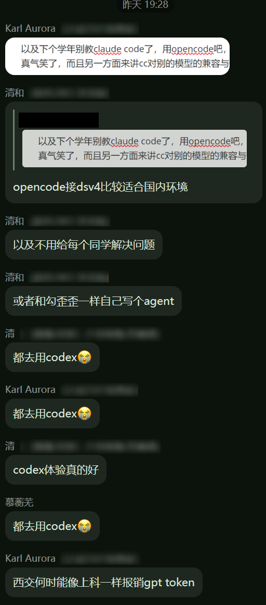

这个话题我觉得有点工具崇拜了。课程教的是 Claude Code大概只是因为 Bin Shi 用 cc 比较多 / cc确实最热门，不代表必须赞美 Claude Code，也不代表 Claude Code 在所有场景下都最好。反过来，说“别用 CC、都用 OpenCode”或者“都去用 Codex”，也没有比吹 CC 高明多少。

我个人反而觉得 **cc效果比codex好**，原因很简单只是**背后模型令人感动**。在代码工作上二者在这个简单的工作上效果没有什么显著差别，而**文案就直接让我红温了**因为GPT模型实在是**太严重的媚用户+ooc**（out of character）了：

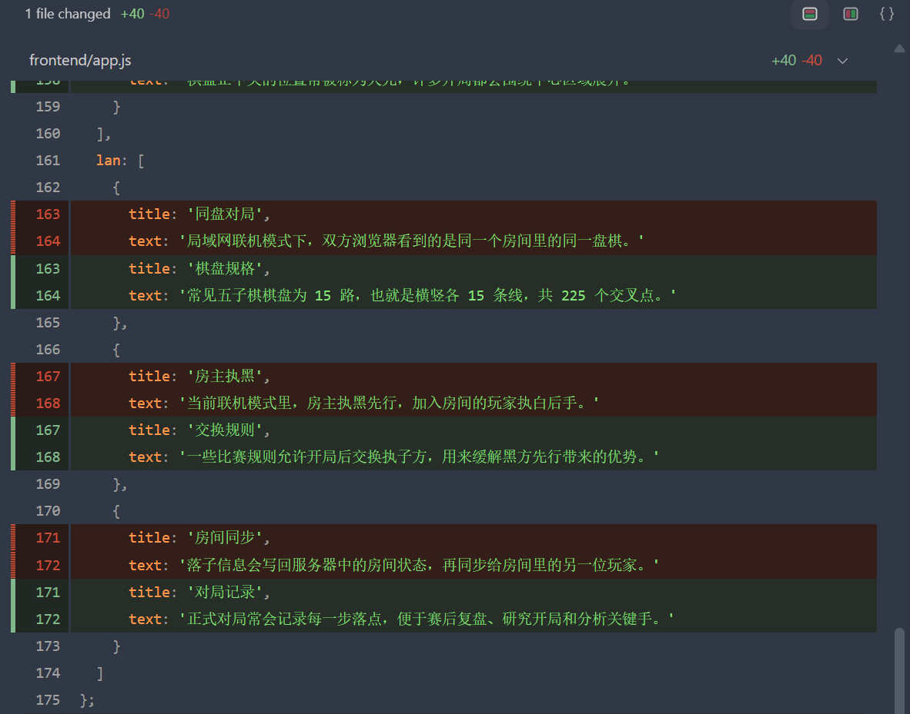

举个新例子（旧例子已经前面一堆了）。我要求他写一些趣闻文本，要求是“从网络上找一些五子棋的趣闻/新闻/历史”，结果是怎么样呢？

- ooc：趣闻还是网站教学的口吻，跟玩家说什么“局域网联机就是……”
- 抓偏主题：我什么时候说要和模式内容结合了？结果煞有介事的搜了一堆之后**全给我这种把这一模式玩法/算法拆开说的弱智文本**

反复强调后才修改如图。

事实就是现在的 **ChatGPT 不管是对话中还是在 Coding Agent 中都有严重的**……

- **媚用户**（一有新指令就严正百分之二百执行，至于前面的指示不管了）
- **强烈纠正显摆意识**（一定要加一堆不是而是，在不合适的地方突然跳出来说“我没犯……错误”）
- **OOC**（不顾场合，经常把给用户背书的话和一些需要角色扮演/给其他人看的文本中混淆）
- **不说人话**（压的最实……）

而且之前提到，只要仓库 Git 历史正常、关键文件还在、（聊天记录能找回来，实际上没有的话影响很大吗？），让不同 AI 或 vibecoding 工具交接工作其实并不难。所以可以便捷地切换工具……

而且 codex 神秘的权限限制……

所以说，**实际上各个 vibe coding 工具效能差别很大吗？重点还是在模型！工具崇拜、公司崇拜不可取！**

（注：但是支持开源软件确实值得支持）

## 感想总结

这是我第一次尝试 vibe coding。

一开始在安装 claude code 时都捉襟见肘很不适应，调教完成后发觉方便顿时豁然开朗，但账单飞涨又打乱了计划又得忙着去弄codex……而codex熟悉之后，vibe coding的喜悦逐渐散去，gpt的老问题开始冒了出来，沙箱权限问题也是恼人，也出现了很多需要人工排bug的地方……

氛围编程确实非常引人入胜，只需要输出你的要求，就可以**调兵遣将**完成任务，这种一切皆有可能 & 指挥者架构师的角色确实让人着迷，而且确实可以看**翔实激动人心的计划**和**不错的成果**……

但是这无法掩盖**AI不是万能的**。往往**架构类**的东西AI并不会主动提出（例如非仓颉网页 / 将仓颉文件分装都是我提了AI才做的），而AI自己的幻觉问题、写文案蹩脚问题、上下文脱节问题也**并不会因为在本地cli就显著改善**！

如果只是**寄希望于烧token就可以解决一切，那是过于被表面突飞猛进的AI蒙蔽了双眼**。更多的能力还是要从**自己对代码的架构把控、审阅出发**！

**永远对AI保持审慎，但也永远乐于接纳新技术**，这才是古法编程式微时代 programmers 正确的对待AI的态度！

> 支持 [黄泉のツガイ](https://bgm.tv/subject/568572) 谢谢喵！
>
> ©Hiromu Arakawa/SQUARE ENIX, Project TSUGAI
